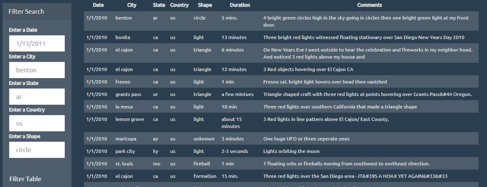

# javascript-challenge
### Summary
This repository contains a dashboard showing the search engine for multiple parameters in JavaScript, HTML, and CSS, and D3.js.
The information was provided by ALIENS-R-REAL. 
### Technical Details
In order to run the code, it is required: 
Google Chrome, Firefox or any other explorer. 
### Screenshots
Output.JPG 
  
### Explanations 
The outcome is shown in screenshots for reference purpose of the public. 

# JavaScript and DOM Manipulation

Write code that will create a table dynamically based upon a dataset we provide.

Allow users to filter the table data for specific values.

Add static folder containing all javascript codes

Automatic Table and Date Search

Create a basic HTML web page or use the index.html file provided.

Using the UFO dataset provided in the form of an array of JavaScript objects, write code that appends a table to your web page and then adds new rows of data for each UFO sighting.

Include the following columns: date/time, city, state, country, shape, and comment at the very least.

Use a date form in your HTML document and write JavaScript code that will listen for events and search through the date/time column to find rows that match user input.

Using multiple input tags and/or select dropdowns, write a JavaScript code so the user can to set multiple filters and search for UFO sightings using the following criteria based on the table columns:

* date/time
* city
* state
* country
* shape

